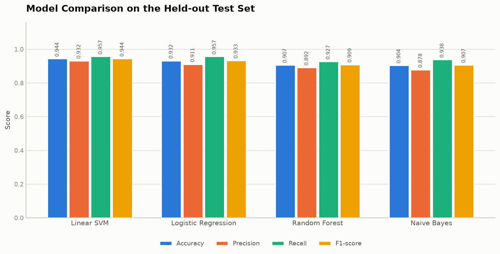

# Fake News Detection Using Machine Learning

A web-based system that classifies news headlines and articles as **FAKE** or **REAL**
using Natural Language Processing and supervised machine learning.



---

## Table of contents

1. [Abstract](#1-abstract)
2. [Problem statement](#2-problem-statement)
3. [Objectives](#3-objectives)
4. [Features](#4-features)
5. [Technology stack](#5-technology-stack)
6. [System architecture](#6-system-architecture)
7. [Machine learning workflow](#7-machine-learning-workflow)
8. [Dataset requirements](#8-dataset-requirements)
9. [Installation](#9-installation)
10. [Training the model](#10-training-the-model)
11. [Running the application](#11-running-the-application)
12. [API documentation](#12-api-documentation)
13. [Screenshots](#13-screenshots)
14. [Results](#14-results)
15. [Testing](#15-testing)
16. [Project structure](#16-project-structure)
17. [Deploying a shareable link](#17-deploying-a-shareable-link)
18. [Limitations](#18-limitations)
19. [Future enhancements](#19-future-enhancements)
20. [Disclaimer](#20-disclaimer)

---

## 1. Abstract

The rapid spread of misinformation through social media and online news platforms has
made the automatic detection of misleading content an important research problem.
This project implements an end-to-end fake news detection system that applies natural
language processing to clean and normalise raw news text, converts that text into
numerical features using **TF-IDF vectorization**, and classifies it using supervised
machine learning.

Four classifiers — **Logistic Regression**, **Multinomial Naive Bayes**, **Linear
Support Vector Machine** and **Random Forest** — are trained on a labelled news corpus
of 6,304 articles and compared on accuracy, precision, recall and F1-score. The best
performing model is chosen by cross-validation on the training split and deployed
behind a **Flask** web application offering an interactive interface, an analytics
dashboard, a searchable prediction history and a JSON API.

The selected model achieves **94.37% accuracy** on a held-out test set of 1,261
articles the model never saw during training.

---

## 2. Problem statement

Misinformation spreads faster and further than accurate reporting, and the volume of
content published daily makes manual fact-checking impossible at scale. Human
verification is accurate but slow; there is a need for an automated tool that can
rapidly flag content that *warrants* human review.

This project addresses a well-defined, tractable slice of that problem: **given the
text of a news article, can a machine learning model identify whether its writing
style and vocabulary resemble content previously labelled as fake?**

The system is explicitly a **triage and screening aid**, not a fact-checker. It has no
knowledge base and cannot verify claims — it recognises linguistic patterns.

---

## 3. Objectives

1. Build a reusable NLP preprocessing pipeline for raw news text.
2. Convert cleaned text into numerical features using TF-IDF with n-grams.
3. Train and rigorously compare four supervised classification algorithms.
4. Select a model using a documented, reproducible criterion — never by assertion.
5. Evaluate performance with accuracy, precision, recall, F1-score and a confusion matrix.
6. Deploy the trained model in a responsive, accessible web application.
7. Provide a JSON API for programmatic access.
8. Persist prediction history on the user's own device with search and filtering.
9. Explain predictions by surfacing the terms that influenced them.
10. Communicate results responsibly, with clear limitations and disclaimers.

---

## 4. Features

### Machine learning
- Nine-step NLP preprocessing pipeline (shared by training and prediction)
- TF-IDF vectorization with unigrams and bigrams, 20,000 features
- Four algorithms trained and compared on identical splits
- Model selection by 5-fold cross-validation on the training split only
- Reproducible results via a fixed `random_state`
- Automatic generation of evaluation charts

### Web application
- Clean, responsive dashboard that works from phone to desktop
- **Light and dark mode** with the preference remembered
- Live character counter and keyboard shortcut (Ctrl/Cmd + Enter)
- Animated confidence meter and class-probability breakdown
- **Explainability panel** showing which terms drove each prediction
- Analytics dashboard with interactive Chart.js charts
- Searchable, filterable prediction history, stored on your own device
- JSON API with proper HTTP status codes

### Engineering
- Input validation with length limits and sanitisation
- No server-side user data at rest — history never leaves the visitor's browser
- Jinja2 autoescaping on all user-supplied output
- Secrets read from the environment, never hard-coded
- Internal errors logged server-side with a reference id; never shown to users
- 61 automated tests

---

## 5. Technology stack

| Layer | Technology |
|-------|-----------|
| Language | Python 3.11+ |
| Machine learning | scikit-learn |
| NLP | NLTK (stopwords, WordNet lemmatizer) |
| Data handling | pandas, NumPy |
| Model persistence | joblib |
| Web framework | Flask, Jinja2 |
| Frontend | HTML5, CSS3, vanilla JavaScript |
| Charts | Chart.js (web), Matplotlib + Seaborn (reports) |
| Storage | Browser localStorage (no server-side database) |
| Testing | unittest (standard library) |

---

## 6. System architecture

The system is organised in four layers. Data flows downward during training and
upward during prediction.

```
┌──────────────────────────────────────────────────────────────┐
│                     PRESENTATION LAYER                       │
│   Browser  ·  HTML/CSS/JS  ·  Chart.js  ·  JSON API client   │
└───────────────────────────┬──────────────────────────────────┘
                            │ HTTP
┌───────────────────────────▼──────────────────────────────────┐
│                     APPLICATION LAYER  (app.py)              │
│   Routing · Validation · Error handling · Session/flash      │
└──────────┬────────────────────────────────┬──────────────────┘
           │                                │
┌──────────▼──────────────────┐  ┌──────────▼──────────────────┐
│     ML SERVICE LAYER        │  │   CLIENT-SIDE PERSISTENCE   │
│  predict.py                 │  │  history-store.js           │
│  preprocessing.py           │  │  Browser localStorage       │
│  ↓ loads                    │  │  (per device, never sent     │
│  model.pkl · vectorizer.pkl │  │   to the server)            │
└──────────▲──────────────────┘  └─────────────────────────────┘
           │ produced offline by
┌──────────┴───────────────────────────────────────────────────┐
│                      TRAINING PIPELINE                       │
│  dataset.py → preprocessing.py → train_model.py              │
│            → evaluate_model.py → reports/*.png               │
└──────────────────────────────────────────────────────────────┘
```

**Key design decision:** training is entirely *offline*. The web application never
trains — it only loads two serialised artefacts. This keeps request handling fast
(milliseconds) and means the app cannot be destabilised by a training failure.

---

## 7. Machine learning workflow

```
Raw CSV  →  Validate  →  Clean  →  Preprocess  →  Split  →  TF-IDF  →  Train  →  Select  →  Save
                                                     │          │
                                            (stratified,   (fit on TRAIN only,
                                             seeded)        transform test)
```

### Step 1 — Preprocessing (`src/preprocessing.py`)

Applied identically at training time and prediction time:

| # | Step | Example |
|---|------|---------|
| 1 | Lowercasing | `BREAKING` → `breaking` |
| 2 | URL removal | `https://x.com/a` → *(removed)* |
| 3 | HTML removal | `<b>news</b>` → `news` |
| 4 | Special characters | `news!!!` → `news` |
| 5 | Number handling | `in 2024` → `in` |
| 6 | Tokenization | `"a b c"` → `[a, b, c]` |
| 7 | Stopword removal | `the, is, at` → *(removed)* |
| 8 | Lemmatization | `studies` → `study` |
| 9 | Whitespace normalisation | `a   b` → `a b` |

### Step 2 — TF-IDF vectorization

TF-IDF = **Term Frequency × Inverse Document Frequency**.

```
tf-idf(t, d) = tf(t, d) × log(N / df(t))
```

A term scores highly when it occurs often in *one* document but rarely across the
corpus — exactly the property that makes a term useful for discriminating between
classes. Words appearing everywhere (`said`, `news`) get low weights automatically.

Configuration (in `src/config.py`):

| Parameter | Value | Reason |
|-----------|-------|--------|
| `max_features` | 20,000 | Caps dimensionality; keeps the most informative terms |
| `ngram_range` | (1, 2) | Captures phrases such as `mainstream media` |
| `min_df` | 3 | Drops typos and one-off noise |
| `max_df` | 0.85 | Drops terms in >85% of documents (no signal) |
| `sublinear_tf` | True | Dampens very high counts with `1 + log(tf)` |

### Step 3 — Model selection and leakage prevention

Three separate measures keep the reported score honest:

1. **The vectorizer is fitted on the training split only.** `fit_transform` on train,
   `transform` on test. Fitting on all data would leak test vocabulary and document
   frequencies into the features.
2. **Model selection uses cross-validation inside the training split.** The test set is
   touched exactly once, to produce the final number. Picking the winner by test score
   would make that score optimistic.
3. **Duplicate articles are removed before splitting**, so the same article cannot
   appear in both halves.

---

## 8. Dataset requirements

The dataset must be a CSV containing at least:

| Column | Required | Description |
|--------|----------|-------------|
| `text` | Yes | The article body |
| `label` | Yes | `FAKE` or `REAL` (also accepts `fake`/`real`, `true`/`false`, `0`/`1`) |
| `title` | No | The headline; combined with `text` when present |

Place the file at any of these paths — the loader searches them in order:

```
data/raw/fake_or_real_news.csv
data/dataset.csv
data/raw/dataset.csv
data/raw/news.csv
```

### Getting the default dataset

```bash
python src/dataset.py --download
```

This fetches the public **"Fake or Real News"** dataset (6,335 rows, ~30 MB), which
already uses the required `title` / `text` / `label` schema.

> The raw dataset is **not committed to git** (it is 30 MB and freely downloadable).
> The `.gitignore` excludes it; the command above recreates it.

After cleaning — dropping duplicates, empty rows and documents that become empty after
preprocessing — **6,304 rows** remain: 3,150 FAKE and 3,154 REAL. The classes are
almost perfectly balanced, which is why plain accuracy is a meaningful metric here.

---

## 9. Installation

### Prerequisites
- Python 3.11 or newer
- pip

### Steps

```bash
# 1. Clone and enter the project
git clone <repository-url>
cd fake_news_detection

# 2. Create a virtual environment
python -m venv venv

# 3. Activate it
#    Windows:
venv\Scripts\activate
#    macOS / Linux:
source venv/bin/activate

# 4. Install dependencies
pip install -r requirements.txt

# 5. Download the NLTK corpora (one-off, ~10 MB)
python -c "import nltk; [nltk.download(p, quiet=True) for p in ['stopwords','wordnet','omw-1.4','punkt']]"

# 6. Configure the environment (optional but recommended)
cp .env.example .env        # Windows: copy .env.example .env
```

> **Note:** if `python -m venv venv` fails with an `ensurepip is not available` error on
> Debian/Ubuntu, install the venv package first: `sudo apt install python3-venv`.

---

## 10. Training the model

```bash
# Download the dataset (skip if you supplied your own)
python src/dataset.py --download

# Train all four models, compare them and save the winner
python src/train_model.py
```

Expected output (abridged):

```
INFO | Loaded 6335 raw rows from fake_or_real_news.csv
INFO | Removed 29 duplicate article(s).
INFO | Cleaned dataset: 6306 rows (REAL=3154, FAKE=3152)
INFO | Running NLP preprocessing on 6306 documents...
INFO | Split: 5043 training rows / 1261 test rows (test_size=20%)
INFO | TF-IDF vocabulary: 20000 features
INFO | Training: Logistic Regression
INFO |   CV F1 (macro): 0.9183 (+/- 0.0088)  |  test accuracy: 0.9318
...
Selected model: Linear SVM

MODEL COMPARISON (held-out test set, positive class = FAKE)
Model                   Accuracy  Precision   Recall       F1  Train (s)
Linear SVM                0.9437     0.9320   0.9571   0.9444       0.45
Logistic Regression       0.9318     0.9109   0.9571   0.9334       0.46
Random Forest             0.9072     0.8916   0.9270   0.9089       4.64
Naive Bayes               0.9040     0.8782   0.9381   0.9071       0.02

Total time: 48.2s
```

Training takes roughly **50 seconds** on a typical laptop and writes:

| File | Contents |
|------|----------|
| `models/model.pkl` | The trained classifier |
| `models/vectorizer.pkl` | The fitted TF-IDF vectorizer |
| `models/metrics.json` | All metrics, used by the dashboard |
| `reports/confusion_matrix.png` | Confusion matrix of the selected model |
| `reports/model_comparison.png` | All four algorithms compared |
| `reports/performance_metrics.png` | Per-class precision / recall / F1 |

### Useful options

```bash
# Rebuild the preprocessing cache (after changing preprocessing rules)
python src/train_model.py --rebuild

# Pin a specific algorithm instead of data-driven selection
PRIMARY_MODEL="Logistic Regression" python src/train_model.py

# Re-evaluate the saved model without retraining
python src/evaluate_model.py

# Classify text from the command line
python src/predict.py "your news text here"
```

---

## 11. Running the application

```bash
python app.py
```

Then open **http://127.0.0.1:5000**.

| Route | Description |
|-------|-------------|
| `/` | Prediction form |
| `/dashboard` | Analytics and model metrics |
| `/history` | Searchable prediction history |
| `/about` | Project information and limitations |

The app starts even without a trained model — it displays a clear warning and disables
prediction until you run the training script.

---

## 12. API documentation

### `POST /api/predict`

**Request**

```http
POST /api/predict
Content-Type: application/json

{"text": "news article text"}
```

**Response `200 OK`**

```json
{
  "prediction": "FAKE",
  "confidence": 0.9979,
  "model": "Linear SVM",
  "probabilities": {"FAKE": 0.9979, "REAL": 0.0021},
  "confidence_label": "High",
  "explanation": "Model prediction: FAKE. The model assigns 99.8% probability ...",
  "top_features": [{"term": "shocking", "contribution": 0.13, "supports": "FAKE", "weight": 1.0}],
  "word_count": 18,
  "disclaimer": "This system provides an ML-based classification and should not be treated as a substitute for professional fact-checking."
}
```

**Error responses**

| Status | Condition | Body |
|--------|-----------|------|
| `400` | Malformed JSON, missing `text`, empty, too short, or too long | `{"error": "...", "status": 400}` |
| `413` | Request body over 1 MB | `{"error": "The submitted content is too large...", "status": 413}` |
| `503` | Model not trained yet | `{"error": "The prediction model has not been trained yet...", "status": 503}` |
| `500` | Unexpected server error | `{"error": "An internal server error occurred.", "status": 500, "error_id": "a1b2c3d4"}` |

> On a `500`, the `error_id` also appears in the server log alongside the full
> traceback. This lets a problem be traced without ever exposing internals to a client.

### Other endpoints

| Endpoint | Method | Returns |
|----------|--------|---------|
| `/api/stats` | GET | Usage statistics (totals, breakdown, daily series) |
| `/api/metrics` | GET | Full evaluation metrics from `models/metrics.json` |
| `/api/health` | GET | Readiness probe: `{"status": "ok", "model_ready": true}` |

### Example

```bash
curl -X POST http://127.0.0.1:5000/api/predict \
  -H "Content-Type: application/json" \
  -d '{"text": "Washington (Reuters) - The Senate approved a bipartisan spending agreement on Tuesday."}'
```

```python
import requests

response = requests.post(
    "http://127.0.0.1:5000/api/predict",
    json={"text": "your news text here"},
    timeout=10,
)
result = response.json()
print(result["prediction"], result["confidence"])
```

---

## 13. Screenshots

> Add your own screenshots to `static/images/` and link them here.

| Page | File |
|------|------|
| Main prediction form | `static/images/screenshot-home.png` |
| Result with confidence meter | `static/images/screenshot-result.png` |
| Analytics dashboard | `static/images/screenshot-dashboard.png` |
| Prediction history | `static/images/screenshot-history.png` |
| Dark mode | `static/images/screenshot-dark.png` |

The evaluation charts in `reports/` are generated automatically and can be included
directly in a project report:

| Chart | File |
|-------|------|
| Confusion matrix | `reports/confusion_matrix.png` |
| Model comparison | `reports/model_comparison.png` |
| Per-class performance | `reports/performance_metrics.png` |

---

## 14. Results

All figures below were produced by `python src/train_model.py` on the dataset
described in section 8. They are written to `models/metrics.json` at training time —
**nothing here is hand-entered**. Your numbers will match if you use the same dataset
and the default `random_state = 42`.

### Model comparison

Evaluated on 1,261 held-out test articles. Precision, recall and F1 treat **FAKE as
the positive class**, because the purpose of the system is to catch fake news.

| Model | Accuracy | Precision | Recall | F1-score | CV F1 (train) |
|-------|---------:|----------:|-------:|---------:|--------------:|
| **Linear SVM** *(selected)* | **0.9437** | 0.9320 | 0.9571 | **0.9444** | 0.9348 ± 0.0093 |
| Logistic Regression | 0.9318 | 0.9109 | 0.9571 | 0.9334 | 0.9183 ± 0.0088 |
| Random Forest | 0.9072 | 0.8916 | 0.9270 | 0.9089 | 0.9050 ± 0.0095 |
| Naive Bayes | 0.9040 | 0.8782 | 0.9381 | 0.9071 | 0.9072 ± 0.0068 |

**Linear SVM was selected** because it achieved the highest mean F1 (0.9348) across
5-fold cross-validation *on the training split*. Its test accuracy of 94.37% was then
measured once, after selection.

Both linear models (SVM, Logistic Regression) outperformed Random Forest here. This is
the expected result for sparse, high-dimensional TF-IDF features: with 20,000 mostly-zero
features, a linear decision boundary generalises better than axis-aligned tree splits,
and it trains ten times faster.

### Confusion matrix — Linear SVM

|  | Predicted FAKE | Predicted REAL |
|--|---------------:|---------------:|
| **Actual FAKE** | 603 ✅ | 27 ❌ |
| **Actual REAL** | 44 ❌ | 587 ✅ |

- **603 true positives** — fake articles correctly flagged
- **587 true negatives** — real articles correctly cleared
- **27 false negatives** — fake articles missed (4.3% of fake articles)
- **44 false positives** — real articles wrongly flagged (7.0% of real articles)

The model misses fewer fake articles than it wrongly flags real ones, i.e. it leans
slightly toward flagging. For a screening tool that is usually the preferable bias, since
a flagged article goes to a human reviewer rather than being deleted.

### Per-class performance

| Class | Precision | Recall | F1-score | Support |
|-------|----------:|-------:|---------:|--------:|
| FAKE | 0.9320 | 0.9571 | 0.9444 | 630 |
| REAL | 0.9560 | 0.9303 | 0.9430 | 631 |

Performance is balanced across both classes — the model is not achieving its score by
favouring one class.

---

## 15. Testing

```bash
python -m unittest discover -s tests -v
```

55 tests covering:

| Suite | Coverage |
|-------|----------|
| `test_preprocessing.py` | All nine pipeline steps, determinism, edge cases (None/NaN/empty) |
| `test_validation.py` | Length limits, empty input, control characters, safe error messages |
| `test_api.py` | All routes, JSON error handling, status codes, **XSS escaping**, path traversal |

Tests needing a trained model skip automatically when `models/model.pkl` is absent, so
the suite passes on a clean checkout.

---

## 16. Project structure

```
fake_news_detection/
│
├── app.py                      # Flask application: routes, API, error handlers
├── wsgi.py                     # Production entry point (gunicorn wsgi:app)
├── build.sh                    # Deploy build: deps + NLTK corpora
├── render.yaml                 # Render deployment blueprint
├── Procfile                    # Start command for Railway / Heroku-style hosts
├── requirements.txt            # Python dependencies
├── README.md                   # This file
├── .gitignore                  # Excludes venv, datasets, nltk_data, .env
├── .env.example                # Environment variable template
│
├── data/
│   ├── raw/                    # Raw dataset CSV (not tracked in git)
│   └── processed/              # Cached preprocessed dataset (not tracked)
│
├── models/
│   ├── model.pkl               # Trained classifier
│   ├── vectorizer.pkl          # Fitted TF-IDF vectorizer
│   └── metrics.json            # All evaluation metrics
│
├── src/
│   ├── config.py               # Central configuration and paths
│   ├── exceptions.py           # Custom exception types
│   ├── preprocessing.py        # NLP pipeline (shared: train + predict)
│   ├── dataset.py              # Loading, validation, cleaning, caching
│   ├── train_model.py          # Training pipeline and model selection
│   ├── evaluate_model.py       # Metrics and report charts
│   ├── predict.py              # Prediction service and explainability
│   └── validation.py           # User input validation
│
├── templates/                  # Jinja2 templates
│   ├── base.html  index.html  result.html
│   ├── dashboard.html  history.html  about.html  error.html
│
├── static/
│   ├── css/style.css           # Design tokens, components, light/dark themes
│   ├── js/script.js            # Theme toggle, counter, Chart.js charts
│   ├── js/history-store.js     # Prediction history in browser localStorage
│   └── images/                 # Screenshots
│
│
├── reports/                    # Generated evaluation charts
│   ├── confusion_matrix.png  model_comparison.png  performance_metrics.png
│
├── tests/                      # Automated test suite
│
└── docs/
    ├── PROJECT_REPORT.md       # Full academic documentation
    └── VIVA_QUESTIONS.md       # 20 viva questions with answers
```

---

## 17. Deploying a shareable link

The app is a Python service, so it needs a Python host — GitHub Pages and other
static hosts cannot run it.

Everything needed is already committed: `wsgi.py` (gunicorn entry point),
`build.sh` (installs dependencies and NLTK corpora), `render.yaml` and `Procfile`.
The trained model is committed too, so **no training runs during deploy** — it
takes seconds.

### Render (recommended, free)

1. Push this repository to GitHub.
2. Go to [render.com](https://render.com) → sign in with GitHub.
3. **New → Blueprint** → select this repository. Render reads `render.yaml` and
   configures everything, generating a secure `SECRET_KEY` automatically.
4. Click **Apply** and wait 2–4 minutes.

Your link: `https://fake-news-detector-XXXX.onrender.com`

> **Free tier sleeps** after ~15 minutes idle. The first visit after that takes
> 30–50 seconds to wake up, then it is fast. Fine for sharing a demo; open the
> link yourself a minute before a presentation so it is already awake.

### Any other host

`Procfile` works on Railway, Heroku and similar platforms:

```
web: gunicorn wsgi:app --bind 0.0.0.0:$PORT --workers 2 --threads 4 --timeout 60
```

Set these environment variables:

| Variable | Value | Why |
|----------|-------|-----|
| `SECRET_KEY` | a long random string | Signs session cookies — never reuse the dev default |
| `FLASK_DEBUG` | `0` | Debug mode exposes an interactive console to anyone who triggers an error |
| `PORT` | set by the platform | The app binds to it automatically |

Generate a key with:

```bash
python -c "import secrets; print(secrets.token_hex(32))"
```

### Testing the production setup locally

```bash
PORT=8000 SECRET_KEY=local-test gunicorn wsgi:app --bind 0.0.0.0:8000
```

### Why no database is needed

Prediction history lives in each visitor's browser (`localStorage`), not on the
server. This matters for deployment: free hosting tiers have an **ephemeral
filesystem**, so a server-side SQLite file would be wiped on every redeploy and
every sleep/wake cycle. Storing history client-side means:

- nothing is lost when the server restarts;
- no disk needs to be provisioned or paid for;
- each visitor sees only their own history, so a shared link stays private;
- the server keeps no user data at rest.

The trade-off: history does not follow a user to another browser or device, and
clearing site data erases it.

---

## 18. Limitations

Understanding what the system **cannot** do matters as much as its accuracy.

1. **It does not verify facts.** The model recognises writing style and vocabulary.
   It has no knowledge base and cannot check whether an event occurred. A well-written
   false article can be classified REAL; a badly written true article can be flagged FAKE.
2. **It is bound to its training data.** The dataset centres on 2015–2016 US political
   news. Accuracy on current events, other countries or other domains will be lower.
3. **Topic can be mistaken for style.** The strongest learned FAKE terms include
   `october`, `november` and `hillary` — these reflect *when and what* the fake articles
   in this corpus were about, not deception itself. This is the project's most important
   methodological caveat.
4. **English only.** The stopword list and lemmatizer are English-specific.
5. **Short text is unreliable.** Measured accuracy by input length:

   | Words after preprocessing | ~words typed | Accuracy |
   |--------------------------:|-------------:|---------:|
   | 3 | ~6 | 62.0% |
   | 10 | ~22 | 71.4% |
   | 50 | ~110 | 85.1% |
   | Full article | — | 94.4% |

   Critically, mean confidence stays near 87–94% across that whole range — **the model
   cannot detect its own degradation**. The app therefore flags short input from the
   word count (`MIN_SIGNAL_WORDS`), not from the probability.

6. **It only works on political and world news.** Seven legitimate articles were tested:
   political reporting from India, the UK and the US was classified correctly, but
   sports, science, business and a cake recipe were all labelled FAKE — the science
   article at 97.5% confidence. **The limitation is topic, not country.** An
   out-of-domain detector catches text that is not news at all; it cannot reliably
   separate sports or business *news* from political news, because doing so would mean
   warning on 71% of legitimate articles. See `docs/PROJECT_REPORT.md` §22.8.
7. **It can be evaded.** Anyone who knows the model can write around its patterns.
8. **Bag-of-words ignores word order.** TF-IDF with bigrams captures some local context,
   but not sentence structure, negation or sarcasm.

---

## 19. Future enhancements

| Enhancement | Benefit |
|-------------|---------|
| Transformer models (BERT, RoBERTa) | Understands context and word order; typically 2–4% more accurate |
| Larger, more recent multi-source dataset | Reduces topic bias and improves generalisation |
| Source credibility signals (domain, author) | Adds evidence independent of writing style |
| Fact-checking API integration | Moves from style analysis toward genuine verification |
| Multilingual support | Extends coverage beyond English |
| URL submission with article extraction | Users paste a link instead of text |
| Browser extension | In-place analysis while browsing |
| User feedback loop | Corrections feed periodic retraining |
| Model monitoring and drift detection | Detects degradation as language evolves |
| Docker + production WSGI server | Reproducible deployment (Gunicorn/uWSGI) |

---

## 20. Disclaimer

> **This system provides an ML-based classification and should not be treated as a
> substitute for professional fact-checking.**

Predictions are statistical estimates derived from patterns in one particular dataset.
They indicate that text *resembles* content previously labelled fake or real — they are
not determinations of truth. The system should be used as a screening aid that directs
human attention, never as an authority on whether a claim is true. Always verify
important claims through established fact-checking organisations and primary sources.

---

## License and attribution

Built for academic purposes. The default dataset is the publicly available
"Fake or Real News" corpus. Please cite the dataset source if you publish results
based on it.
