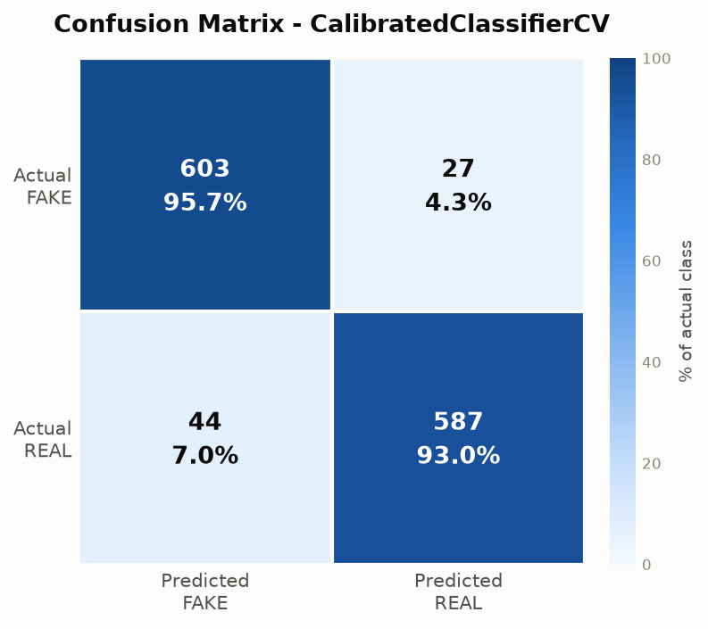
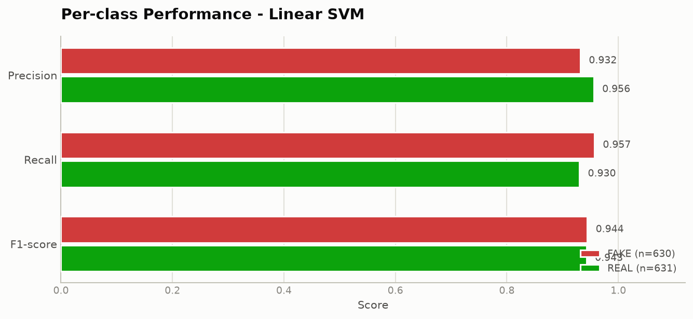

# FAKE NEWS DETECTION USING MACHINE LEARNING

### Academic Project Documentation

---

## Table of contents

| # | Chapter |
|---|---------|
| 1 | [Abstract](#1-abstract) |
| 2 | [Introduction](#2-introduction) |
| 3 | [Existing system](#3-existing-system) |
| 4 | [Proposed system](#4-proposed-system) |
| 5 | [Problem statement](#5-problem-statement) |
| 6 | [Objectives](#6-objectives) |
| 7 | [Scope](#7-scope) |
| 8 | [Literature survey](#8-literature-survey) |
| 9 | [System requirements](#9-system-requirements) |
| 10 | [System architecture](#10-system-architecture) |
| 11 | [Data flow diagram](#11-data-flow-diagram) |
| 12 | [Use case diagram](#12-use-case-diagram) |
| 13 | [Activity diagram](#13-activity-diagram) |
| 14 | [ER diagram](#14-er-diagram) |
| 15 | [Module description](#15-module-description) |
| 16 | [Algorithm](#16-algorithm) |
| 17 | [NLP preprocessing](#17-nlp-preprocessing) |
| 18 | [TF-IDF explanation](#18-tf-idf-explanation) |
| 19 | [Machine learning algorithms](#19-machine-learning-algorithms) |
| 20 | [Implementation](#20-implementation) |
| 21 | [Testing](#21-testing) |
| 22 | [Results](#22-results) |
| 23 | [Advantages](#23-advantages) |
| 24 | [Limitations](#24-limitations) |
| 25 | [Future enhancement](#25-future-enhancement) |
| 26 | [Conclusion](#26-conclusion) |
| 27 | [References](#27-references) |

---

## 1. Abstract

The proliferation of digital news platforms and social media has dramatically increased
the speed at which information — and misinformation — reaches the public. Fabricated
news stories can influence public opinion, damage reputations and undermine trust in
legitimate journalism. Manual verification by fact-checking organisations, while
accurate, cannot match the volume and velocity of content published every day.

This project presents an automated **Fake News Detection System** built using Natural
Language Processing (NLP) and supervised machine learning. Raw news text is passed
through a nine-stage preprocessing pipeline that normalises it and removes noise. The
cleaned text is transformed into numerical feature vectors using **Term Frequency–Inverse
Document Frequency (TF-IDF)** with unigram and bigram features. Four classification
algorithms — Logistic Regression, Multinomial Naive Bayes, Linear Support Vector
Machine and Random Forest — are trained on a labelled corpus of 6,304 news articles and
compared using accuracy, precision, recall, F1-score and confusion-matrix analysis.

Model selection is performed using 5-fold stratified cross-validation on the training
partition alone, ensuring that the held-out test partition contributes only to the final
reported performance figure. Under this protocol the **Linear Support Vector Machine**
achieved the highest cross-validated F1-score (0.9348 ± 0.0093) and was selected. On the
1,261-article held-out test set it attained **94.37% accuracy**, 93.20% precision,
95.71% recall and an F1-score of 94.44%.

The trained model is deployed through a **Flask** web application providing an
interactive classification interface, an analytics dashboard, a searchable prediction
history backed by SQLite, a JSON REST API, and an explainability feature that surfaces
the terms most responsible for each prediction. The system is presented explicitly as a
screening and triage aid rather than an authority on factual truth.

**Keywords:** Fake News Detection, Natural Language Processing, TF-IDF, Text
Classification, Support Vector Machine, Logistic Regression, Machine Learning, Flask.

---

## 2. Introduction

### 2.1 Background

"Fake news" refers to news articles that are intentionally and verifiably false, created
to mislead readers. It differs from honest journalistic error in that the deception is
deliberate. Researchers generally distinguish three related concepts:

- **Misinformation** — false information spread without intent to deceive.
- **Disinformation** — false information created and spread deliberately to deceive.
- **Malinformation** — genuine information shared out of context to cause harm.

This project targets the detection of content resembling **disinformation**, which is
what labelled fake-news datasets typically capture.

### 2.2 Motivation

Three factors make automated detection necessary:

1. **Volume.** Millions of articles and posts are published daily. Human review cannot scale.
2. **Velocity.** Studies have found that false stories spread significantly faster and
   reach more people than true stories, so delayed verification arrives too late.
3. **Consequence.** Misinformation has been linked to public-health harm, financial
   market disruption and the erosion of trust in institutions.

### 2.3 Role of machine learning

Fake and legitimate news differ in measurable linguistic ways. Fabricated articles tend
to use more sensational and emotive vocabulary, heavier punctuation and capitalisation,
fewer verifiable attributions ("according to", "officials said"), and different sentence
structures. These differences are statistical rather than absolute, which makes the
problem well suited to machine learning: rather than encoding rules by hand, a
classifier learns the discriminating patterns from labelled examples.

### 2.4 Role of NLP

Machine learning algorithms operate on numbers, not words. NLP provides the bridge:
preprocessing normalises raw text into a consistent token stream, and vectorization
converts that stream into a numerical feature vector. Without NLP, text cannot be fed to
a classifier at all.

---

## 3. Existing system

### 3.1 Manual fact-checking

Organisations such as Snopes, PolitiFact and FactCheck.org employ trained journalists to
investigate claims.

| Strengths | Weaknesses |
|-----------|-----------|
| Very high accuracy | Extremely slow (hours to days per claim) |
| Provides evidence and reasoning | Cannot scale to daily content volume |
| Handles nuance and context | Expensive; limited coverage |
| Verifies actual facts | Verification arrives after the story has spread |

### 3.2 Keyword and blacklist filtering

Simple automated systems flag content containing suspicious keywords or originating
from blacklisted domains.

| Strengths | Weaknesses |
|-----------|-----------|
| Very fast, trivial to implement | High false-positive rate |
| Easy to understand | Trivially evaded by rewording |
| Low computational cost | Cannot generalise to unseen phrasing |
|  | Blacklists require constant manual upkeep |

### 3.3 Crowd-sourced flagging

Platforms allow users to report content, which is then reviewed.

| Strengths | Weaknesses |
|-----------|-----------|
| Scales with the user base | Vulnerable to coordinated abuse |
| Captures community context | Reflects popularity/bias, not accuracy |
| Low operating cost | Still requires human review downstream |

### 3.4 Limitations addressed by this project

The existing approaches are either accurate but unscalable, or scalable but brittle.
This project occupies the middle ground: an automated system that learns generalisable
linguistic patterns rather than fixed keywords, operating in milliseconds per article
while providing a calibrated confidence score so that uncertain cases can be escalated
to human review.

---

## 4. Proposed system

### 4.1 Overview

The proposed system is a web-based application that accepts a news headline or article
and returns a classification (FAKE or REAL), a probability, and an explanation of which
terms influenced the result.

### 4.2 Key characteristics

| Characteristic | Description |
|----------------|-------------|
| **Learned, not rule-based** | Patterns are derived from 6,304 labelled articles, not hand-coded |
| **Offline training** | Training is separate from serving; the web app only loads artefacts |
| **Evidence-based selection** | Four algorithms are compared; the winner is chosen by cross-validation |
| **Confidence-aware** | Every prediction carries a probability, so weak results can be flagged |
| **Explainable** | Term-level contributions are exposed to the user |
| **Persistent** | All predictions are logged to SQLite for analysis |
| **Accessible** | Responsive UI with light/dark themes and keyboard support |
| **Programmable** | JSON API allows integration with other systems |
| **Honest** | Limitations and disclaimers are surfaced in the interface itself |

### 4.3 Advantages over the existing system

1. **Speed** — classification completes in milliseconds versus hours for manual review.
2. **Scalability** — throughput limited only by hardware.
3. **Consistency** — identical input always yields an identical result; no reviewer fatigue or bias.
4. **Generalisation** — recognises patterns in previously unseen wording, unlike keyword filters.
5. **Transparency** — reports confidence and contributing terms rather than an opaque verdict.
6. **Measurability** — performance is quantified on a held-out test set and can be re-measured.

---

## 5. Problem statement

> **To design and implement an automated system that analyses the textual content of a
> news headline or article and classifies it as FAKE or REAL using natural language
> processing and supervised machine learning, providing a confidence score and an
> explanation, while clearly communicating that the classification is a linguistic
> pattern assessment and not a verification of factual accuracy.**

### 5.1 Formal definition

Given a document *d* consisting of a sequence of words, learn a function

```
f : d → {FAKE, REAL} × [0, 1]
```

that maps the document to a class label and an associated confidence, such that the
classification error on unseen documents is minimised.

### 5.2 Challenges

| Challenge | How this project addresses it |
|-----------|------------------------------|
| Text is unstructured | Nine-stage NLP preprocessing pipeline |
| Text is not numeric | TF-IDF vectorization |
| Very high dimensionality | `max_features` cap, `min_df`/`max_df` filtering |
| Risk of data leakage | Vectorizer fitted on train only; CV-based selection; duplicates removed |
| Risk of overfitting | Cross-validation, regularisation, held-out test set |
| Model opacity | Coefficient-based term contribution analysis |
| Over-trust by users | Confidence bands, low-signal warnings, explicit disclaimers |

---

## 6. Objectives

### 6.1 Primary objectives

1. Design a reusable NLP preprocessing pipeline applicable to raw news text.
2. Implement TF-IDF feature extraction with n-gram support.
3. Train and evaluate four supervised classification algorithms.
4. Select the best model using a documented, reproducible criterion.
5. Deploy the model as an interactive web application.

### 6.2 Secondary objectives

6. Provide a JSON REST API for programmatic access.
7. Persist prediction history in a relational database with search and filtering.
8. Present an analytics dashboard with visualisations of performance and usage.
9. Implement model explainability at the individual-prediction level.
10. Apply professional software practices: validation, error handling, security, testing.
11. Communicate the system's limitations honestly within the interface.

---

## 7. Scope

### 7.1 In scope

- Binary classification of English-language news text into FAKE / REAL
- Text-content analysis only (headline and/or article body)
- Supervised learning from a labelled, publicly available dataset
- Web interface and JSON API
- Local SQLite persistence of prediction history
- Evaluation reporting and visualisation

### 7.2 Out of scope

- Factual verification of claims against external knowledge sources
- Image, video or audio analysis (deepfake detection)
- Non-English languages
- Social-network propagation analysis
- Real-time crawling or monitoring of news sites
- User authentication and multi-tenant accounts
- Production-grade deployment infrastructure

---

## 8. Literature survey

### 8.1 Summary of related work

| # | Study / Approach | Method | Key finding |
|---|------------------|--------|-------------|
| 1 | Conroy, Rubin & Chen (2015) | Survey of linguistic vs. network methods | Hybrid approaches combining linguistic cues and network data outperform either alone |
| 2 | Shu et al. (2017) | Data-mining survey of fake news detection | Establishes the standard taxonomy: content-based, social-context-based, and hybrid |
| 3 | Wang (2017), "Liar, Liar Pants on Fire" | LIAR benchmark dataset, 12.8k statements | Short statements alone are difficult; metadata improves results substantially |
| 4 | Ahmed, Traore & Saad (2017) | TF-IDF + n-grams with SVM and LR | Linear models on n-gram TF-IDF achieve ~92% accuracy; bigrams add measurable gain |
| 5 | Vosoughi, Roy & Aral (2018), *Science* | Analysis of Twitter cascades | False news spreads significantly faster, deeper and more broadly than true news |
| 6 | Pérez-Rosas et al. (2018) | Linguistic feature analysis | Fake news shows distinct patterns in punctuation, readability and sentiment |
| 7 | Devlin et al. (2019) | BERT transformer architecture | Contextual embeddings surpass bag-of-words on most text classification tasks |
| 8 | Zhou & Zafarani (2020) | Comprehensive survey | Identifies dataset bias and poor cross-domain generalisation as central open problems |

### 8.2 Observations drawn from the literature

1. **TF-IDF with linear classifiers is a strong, well-established baseline.** Ahmed et al.
   report ~92% accuracy with this exact configuration; the 94.37% obtained in this
   project is consistent with that body of work.
2. **Including bigrams improves performance** over unigrams alone, which motivated the
   `ngram_range=(1, 2)` setting used here.
3. **Linear models outperform tree ensembles on sparse high-dimensional text**, a finding
   this project independently reproduces (Linear SVM 0.9437 vs. Random Forest 0.9072).
4. **Transformers outperform bag-of-words**, but at substantially higher computational
   cost — which is why they are listed as future enhancement rather than core scope.
5. **Dataset bias is the dominant limitation** in this research area. Models frequently
   learn topical correlations rather than deception markers. This project acknowledges
   the issue explicitly in its results discussion.

### 8.3 Research gap addressed

Much published work reports accuracy figures without addressing deployability,
explainability or the honest communication of limitations. This project deliberately
closes that gap by pairing a rigorous, leakage-free evaluation protocol with a working
deployed application that exposes confidence, explanation and caveats to the end user.

---

## 9. System requirements

### 9.1 Hardware requirements

**Minimum**

| Component | Specification |
|-----------|--------------|
| Processor | Dual-core, 2.0 GHz |
| RAM | 4 GB |
| Storage | 2 GB free |
| Display | 1024 × 768 |
| Network | Required for initial setup only |

**Recommended**

| Component | Specification |
|-----------|--------------|
| Processor | Quad-core, 2.5 GHz or higher |
| RAM | 8 GB or more |
| Storage | 5 GB free (SSD) |
| Display | 1920 × 1080 |

> Measured resource use: training peaks at roughly 1.5 GB RAM and completes in about
> 50 seconds; the running web application uses approximately 200 MB.

### 9.2 Software requirements

| Category | Requirement |
|----------|------------|
| Operating system | Windows 10/11, macOS 11+, or Linux |
| Language | Python 3.11 or newer |
| Package manager | pip |
| Browser | Chrome, Firefox, Edge or Safari (current version) |
| IDE | Visual Studio Code (recommended) |
| Version control | Git |

### 9.3 Python libraries

| Library | Version | Purpose |
|---------|---------|---------|
| pandas | ≥ 2.1.0 | Data loading and manipulation |
| numpy | ≥ 1.26.0 | Numerical operations |
| scikit-learn | ≥ 1.4.0 | ML algorithms, TF-IDF, metrics |
| nltk | ≥ 3.8.1 | Stopwords, lemmatization |
| joblib | ≥ 1.3.2 | Model serialisation |
| matplotlib | ≥ 3.8.0 | Report chart generation |
| seaborn | ≥ 0.13.0 | Statistical chart styling |
| Flask | ≥ 3.0.0 | Web framework |
| python-dotenv | ≥ 1.0.0 | Environment variable loading |

### 9.4 Functional requirements

| ID | Requirement |
|----|-------------|
| FR-01 | The system shall accept news text via a web form |
| FR-02 | The system shall validate input length and content before processing |
| FR-03 | The system shall classify input as FAKE or REAL |
| FR-04 | The system shall report a confidence probability with each classification |
| FR-05 | The system shall display the terms that influenced the prediction |
| FR-06 | The system shall store every prediction with a timestamp |
| FR-07 | The system shall allow the history to be searched and filtered |
| FR-08 | The system shall allow the history to be cleared after confirmation |
| FR-09 | The system shall expose a JSON API for classification |
| FR-10 | The system shall display aggregate statistics and model metrics |
| FR-11 | The system shall display a disclaimer wherever a prediction is shown |

### 9.5 Non-functional requirements

| ID | Requirement | Target | Measured |
|----|-------------|--------|----------|
| NFR-01 | Prediction response time | < 1 s | ~50 ms |
| NFR-02 | Model accuracy | > 85% | 94.37% |
| NFR-03 | Interface responsiveness | Mobile to desktop | Verified at 320 px–1920 px |
| NFR-04 | Input size limit | Enforced | 20,000 chars / 1 MB body |
| NFR-05 | Error handling | No internal details exposed | Verified by test |
| NFR-06 | Availability without a model | App still starts | Verified by test |

---

## 10. System architecture

### 10.1 Layered architecture

```
┌────────────────────────────────────────────────────────────────┐
│                      PRESENTATION LAYER                        │
│  index.html · result.html · dashboard.html · history.html      │
│  style.css (design tokens, light/dark) · script.js · Chart.js  │
└───────────────────────────┬────────────────────────────────────┘
                            │ HTTP request / response
┌───────────────────────────▼────────────────────────────────────┐
│                      APPLICATION LAYER                         │
│                          app.py                                │
│  Routing · Input validation · Error handlers · Flash messages  │
└──────────┬──────────────────────────────────┬──────────────────┘
           │                                  │
┌──────────▼───────────────────┐  ┌───────────▼──────────────────┐
│     BUSINESS LOGIC LAYER     │  │     DATA ACCESS LAYER        │
│  predict.py   (inference)    │  │  database.py                 │
│  preprocessing.py  (NLP)     │  │  Parameterised SQL           │
│  validation.py (input rules) │  │  Connection context manager  │
└──────────┬───────────────────┘  └───────────┬──────────────────┘
           │ loads                            │
┌──────────▼───────────────────┐  ┌───────────▼──────────────────┐
│      MODEL ARTEFACTS         │  │        DATABASE              │
│  model.pkl · vectorizer.pkl  │  │  app.db (SQLite)             │
│  metrics.json                │  │  predictions table           │
└──────────▲───────────────────┘  └──────────────────────────────┘
           │ produced by
┌──────────┴─────────────────────────────────────────────────────┐
│                     TRAINING PIPELINE (offline)                │
│  dataset.py → preprocessing.py → train_model.py                │
│             → evaluate_model.py → reports/*.png                │
└────────────────────────────────────────────────────────────────┘
```

### 10.2 Design rationale

| Decision | Rationale |
|----------|-----------|
| Separate training from serving | Requests stay fast; a training failure cannot destabilise the app |
| Vectorizer saved separately from the model | The app must reproduce the exact feature space; both are fitted state |
| Single shared predictor instance | Artefacts are read from disk once at start-up, not per request |
| Central `config.py` | One place to change any parameter; no scattered magic numbers |
| Custom exception hierarchy | Each layer catches the specific failure it can explain to the user |
| Per-request DB connections | SQLite connections cannot be shared across Flask's threads |

---

## 11. Data flow diagram

### 11.1 Level 0 (context diagram)

```
                  news text                    prediction + confidence
    ┌──────┐  ──────────────────▶  ┌────────────────────┐  ──────────────────▶  ┌──────┐
    │ User │                       │   Fake News        │                        │ User │
    └──────┘  ◀──────────────────  │ Detection System   │  ◀──────────────────   └──────┘
                  history view     └─────────┬──────────┘      statistics
                                             │
                                             ▼
                                   ┌───────────────────┐
                                   │  News Dataset     │
                                   │  (labelled CSV)   │
                                   └───────────────────┘
```

### 11.2 Level 1

```
 ┌──────┐
 │ User │
 └──┬───┘
    │ (1) submits text
    ▼
┌────────────────┐   invalid    ┌──────────────────┐
│ 1.0 Validate   │─────────────▶│  Error message   │──▶ User
│     Input      │              └──────────────────┘
└───────┬────────┘
        │ valid text
        ▼
┌────────────────┐
│ 2.0 Preprocess │  lowercase, strip URLs/HTML/symbols,
│     Text       │  tokenize, remove stopwords, lemmatize
└───────┬────────┘
        │ cleaned tokens
        ▼
┌────────────────┐        ┌──────────────────┐
│ 3.0 Vectorize  │◀───────│  vectorizer.pkl  │  (D1)
│     (TF-IDF)   │        └──────────────────┘
└───────┬────────┘
        │ feature vector
        ▼
┌────────────────┐        ┌──────────────────┐
│ 4.0 Classify   │◀───────│    model.pkl     │  (D2)
└───────┬────────┘        └──────────────────┘
        │ label + probability
        ├──────────────────────────────┐
        ▼                              ▼
┌────────────────┐            ┌──────────────────┐
│ 5.0 Explain    │            │ 6.0 Store        │──▶ (D3) app.db
│   (term        │            │     Prediction   │
│   contributions)│           └──────────────────┘
└───────┬────────┘
        │
        ▼
┌────────────────┐
│ 7.0 Render     │──▶ User
│     Result     │
└────────────────┘
```

### 11.3 Level 1 — training subsystem

```
┌──────────────┐    ┌──────────────┐    ┌──────────────┐    ┌──────────────┐
│ Raw CSV (D0) │───▶│ 1.0 Validate │───▶│ 2.0 Clean    │───▶│ 3.0 Preprocess│
└──────────────┘    │   Schema     │    │  (dedupe,    │    │   (NLP)      │
                    └──────────────┘    │   missing)   │    └───────┬──────┘
                                        └──────────────┘            │
                     ┌──────────────────────────────────────────────┘
                     ▼
              ┌──────────────┐    ┌──────────────┐    ┌──────────────┐
              │ 4.0 Split    │───▶│ 5.0 Fit      │───▶│ 6.0 Train 4  │
              │ (stratified) │    │   TF-IDF     │    │    Models    │
              └──────────────┘    │ (train only) │    └───────┬──────┘
                                  └──────────────┘            │
                     ┌──────────────────────────────────────────┘
                     ▼
              ┌──────────────┐    ┌──────────────┐    ┌──────────────┐
              │ 7.0 Cross-   │───▶│ 8.0 Select   │───▶│ 9.0 Save     │──▶ (D1)(D2)
              │   Validate   │    │    Best      │    │  Artefacts   │──▶ metrics.json
              └──────────────┘    └──────────────┘    └──────────────┘──▶ reports/
```

### 11.4 Data stores

| ID | Store | Contents |
|----|-------|----------|
| D0 | `data/raw/*.csv` | Original labelled dataset |
| D1 | `models/vectorizer.pkl` | Fitted TF-IDF vocabulary and IDF weights |
| D2 | `models/model.pkl` | Trained classifier |
| D3 | `database/app.db` | Prediction history |
| D4 | `models/metrics.json` | Evaluation results |

---

## 12. Use case diagram

### 12.1 Diagram

```
                         Fake News Detection System
        ┌────────────────────────────────────────────────────────┐
        │                                                        │
        │    ( Submit news text for analysis )                   │
        │              ▲                                         │
        │              │ «include»                               │
        │    ( Validate input )                                  │
        │                                                        │
        │    ( View classification result )                      │
        │    ( View confidence score )                           │
        │    ( View influential terms )                          │
   ┌────┴───┐                                                    │
   │  User  │─── ( View prediction history )                     │
   └────┬───┘         ▲          ▲                               │
        │             │«extend»  │«extend»                       │
        │    ( Search history )  ( Filter by FAKE/REAL )         │
        │                                                        │
        │    ( Clear history )                                   │
        │              ▲                                         │
        │              │ «include»                               │
        │    ( Confirm destructive action )                      │
        │                                                        │
        │    ( View analytics dashboard )                        │
        │    ( Toggle light / dark theme )                       │
        │                                                        │
   ┌────┴─────┐                                                  │
   │ API      │─── ( Classify via POST /api/predict )            │
   │ Client   │─── ( Retrieve statistics )                       │
   └────┬─────┘─── ( Retrieve model metrics )                    │
        │                                                        │
   ┌────┴──────────┐                                             │
   │ Administrator │─ ( Train / retrain model )                  │
   │  (developer)  │─ ( Generate evaluation reports )            │
   └───────────────┘─ ( Configure parameters )                   │
        │                                                        │
        └────────────────────────────────────────────────────────┘
```

### 12.2 Actors

| Actor | Description |
|-------|-------------|
| **User** | End user submitting news text through the browser |
| **API Client** | External program consuming the JSON API |
| **Administrator** | Developer who trains the model and configures the system |

### 12.3 Use case specification — *Submit news text for analysis*

| Field | Detail |
|-------|--------|
| **ID** | UC-01 |
| **Actor** | User |
| **Precondition** | A trained model exists; the application is running |
| **Main flow** | 1. User opens the home page.<br>2. User enters or pastes news text.<br>3. Character counter updates live.<br>4. User clicks **Analyze News**.<br>5. System validates the input.<br>6. System preprocesses the text.<br>7. System vectorizes with the saved TF-IDF vectorizer.<br>8. System classifies the vector.<br>9. System computes term contributions.<br>10. System stores the prediction.<br>11. System displays label, confidence, explanation and disclaimer. |
| **Alt. flow A1** | Input is empty or too short → validation message shown; text preserved for correction. |
| **Alt. flow A2** | Input exceeds 20,000 characters → length error shown. |
| **Alt. flow A3** | No trained model present → 503 with instructions to run training. |
| **Alt. flow A4** | Database write fails → prediction is still shown; a warning notes it was not saved. |
| **Postcondition** | Result displayed; prediction recorded in history. |

---

## 13. Activity diagram

### 13.1 Prediction activity

```
                        ( ● Start )
                             │
                             ▼
                   ┌──────────────────┐
                   │ User enters text │
                   └────────┬─────────┘
                            ▼
                   ┌──────────────────┐
                   │  Click Analyze   │
                   └────────┬─────────┘
                            ▼
                        ◇ Valid? ◇
                       ╱          ╲
                   No ╱            ╲ Yes
                     ▼              ▼
          ┌──────────────────┐   ┌──────────────────┐
          │ Show validation  │   │ Preprocess text  │
          │     message      │   │  (9 NLP steps)   │
          └────────┬─────────┘   └────────┬─────────┘
                   │                      ▼
                   │            ◇ Model loaded? ◇
                   │              ╱            ╲
                   │          No ╱              ╲ Yes
                   │            ▼                ▼
                   │  ┌──────────────────┐  ┌──────────────────┐
                   │  │ Return 503 with  │  │ TF-IDF transform │
                   │  │   instructions   │  └────────┬─────────┘
                   │  └────────┬─────────┘           ▼
                   │           │            ┌──────────────────┐
                   │           │            │  Classify vector │
                   │           │            └────────┬─────────┘
                   │           │                     ▼
                   │           │            ┌──────────────────┐
                   │           │            │ Compute term     │
                   │           │            │  contributions   │
                   │           │            └────────┬─────────┘
                   │           │                     ▼
                   │           │          ═══════ fork ═══════
                   │           │            │              │
                   │           │            ▼              ▼
                   │           │  ┌────────────────┐ ┌──────────────┐
                   │           │  │ Save to SQLite │ │ Build result │
                   │           │  └───────┬────────┘ └──────┬───────┘
                   │           │          │                 │
                   │           │          ═══════ join ═════
                   │           │                     ▼
                   │           │            ┌──────────────────┐
                   │           │            │ Render result +  │
                   │           │            │    disclaimer    │
                   │           │            └────────┬─────────┘
                   └───────────┴──────────────────┬──┘
                                                  ▼
                                             ( ◉ End )
```

### 13.2 Training activity

```
( ● Start ) → Load dataset → ◇ File found? ◇ ─No→ Show download instructions → ( ◉ End )
                                   │ Yes
                                   ▼
                        Validate required columns
                                   │
                        ◇ Columns valid? ◇ ─No→ Raise DatasetError → ( ◉ End )
                                   │ Yes
                                   ▼
              Combine title + text → Normalise labels → Drop missing → Drop duplicates
                                   │
                                   ▼
                      Apply NLP preprocessing → Cache to CSV
                                   │
                                   ▼
                     Stratified train/test split (80 / 20, seed 42)
                                   │
                                   ▼
                 Fit TF-IDF on TRAIN only → Transform TEST
                                   │
                                   ▼
        ╔══════════ for each of 4 models ══════════╗
        ║  5-fold cross-validate on training split ║
        ║  Fit on full training split              ║
        ║  Predict on test split, record metrics   ║
        ╚══════════════════════════════════════════╝
                                   │
                                   ▼
              Select highest mean CV F1 → Save model.pkl + vectorizer.pkl
                                   │
                                   ▼
           Write metrics.json → Generate 3 report charts → Print comparison table
                                   │
                                   ▼
                              ( ◉ End )
```

---

## 14. ER diagram

### 14.1 Diagram

```
                    ┌─────────────────────────────────┐
                    │          PREDICTIONS            │
                    ├─────────────────────────────────┤
                    │ PK  id           INTEGER        │
                    │     input_text   TEXT      NN   │
                    │     prediction   TEXT      NN   │  CHECK IN ('FAKE','REAL')
                    │     confidence   REAL      NN   │  CHECK BETWEEN 0 AND 1
                    │     model_name   TEXT      NN   │
                    │     word_count   INTEGER   NN   │
                    │     source       TEXT      NN   │  'web' | 'api'
                    │     created_at   TEXT      NN   │  ISO-8601 UTC
                    └─────────────────────────────────┘
                              │
                              │ indexed by
                              ▼
                 ┌────────────────────────────┐
                 │ idx_predictions_created_at │   (created_at DESC)
                 │ idx_predictions_prediction │   (prediction)
                 └────────────────────────────┘
```

### 14.2 Attribute description

| Attribute | Type | Constraints | Description |
|-----------|------|-------------|-------------|
| `id` | INTEGER | PK, AUTOINCREMENT | Unique identifier |
| `input_text` | TEXT | NOT NULL | Submitted text, truncated to 1,000 characters |
| `prediction` | TEXT | NOT NULL, CHECK | Classification result: FAKE or REAL |
| `confidence` | REAL | NOT NULL, CHECK 0–1 | Model probability for the predicted class |
| `model_name` | TEXT | NOT NULL | Algorithm that produced the prediction |
| `word_count` | INTEGER | NOT NULL, default 0 | Tokens remaining after preprocessing |
| `source` | TEXT | NOT NULL, default 'web' | Origin: `web` or `api` |
| `created_at` | TEXT | NOT NULL | ISO-8601 UTC timestamp |

### 14.3 Design notes

- **Single-table design.** The system stores independent prediction events with no
  shared entities, so normalisation beyond one table would add joins without removing
  any redundancy.
- **Text truncation.** Storing only the first 1,000 characters bounds database growth and
  limits retention of user data.
- **CHECK constraints** enforce validity at the database level, so invalid data cannot be
  written even if an application-level bug occurred.
- **Two indexes** match the two real access patterns: chronological listing and
  filtering by class.
- **UTC timestamps** stored as ISO-8601 text sort correctly lexicographically, which
  SQLite's `DATE()` functions can also parse directly.

---

## 15. Module description

### 15.1 Module summary

| # | Module | File | Responsibility |
|---|--------|------|----------------|
| 1 | Configuration | `src/config.py` | Central paths, hyper-parameters, environment settings |
| 2 | Exceptions | `src/exceptions.py` | Project-specific error types with safe user messages |
| 3 | Preprocessing | `src/preprocessing.py` | Nine-stage NLP pipeline |
| 4 | Dataset | `src/dataset.py` | Loading, validation, cleaning, caching |
| 5 | Training | `src/train_model.py` | Split, vectorize, train, compare, select, save |
| 6 | Evaluation | `src/evaluate_model.py` | Metrics, comparison table, report charts |
| 7 | Prediction | `src/predict.py` | Inference service and explainability |
| 8 | Validation | `src/validation.py` | Input sanitisation and rules |
| 9 | Database | `src/database.py` | SQLite persistence |
| 10 | Web application | `app.py` | Routing, API, error handling |
| 11 | Frontend | `templates/`, `static/` | UI, charts, interactivity |

### 15.2 Module 3 — Preprocessing

**Purpose.** Convert raw, noisy news text into a normalised token string.

**Key class.** `TextPreprocessor`

| Method | Description |
|--------|-------------|
| `clean(text)` | Runs all nine steps and returns a space-joined token string |
| `clean_many(texts)` | Batch version used during training |
| `remove_urls(text)` | Step 2 |
| `remove_html(text)` | Step 3 |
| `remove_special_characters(text)` | Steps 4–5 |
| `tokenize(text)` | Step 6 |
| `filter_tokens(tokens)` | Step 7 |
| `normalise_tokens(tokens)` | Step 8 |

**Critical property.** The *same* class instance type is used by both `train_model.py`
and `predict.py`. If training and prediction cleaned text differently, the model would
receive differently-shaped input at inference and accuracy would silently collapse. This
is the single most important correctness property in the project.

**Resilience.** If NLTK corpora are unavailable, the module falls back to a built-in
stopword list and skips lemmatization with a logged warning rather than crashing.

### 15.3 Module 5 — Training

**Purpose.** Produce the deployable artefacts from the dataset.

| Function | Description |
|----------|-------------|
| `build_candidate_models()` | Constructs the four classifiers |
| `build_vectorizer()` | Constructs TF-IDF from config values |
| `split_dataset(frame)` | Stratified, seeded 80/20 split |
| `vectorize(x_train, x_test)` | `fit_transform` on train, `transform` on test |
| `train_and_evaluate_all(...)` | Cross-validates and tests every model |
| `select_best_model(results)` | Chooses by mean CV F1 (or a pinned model) |
| `extract_top_features(...)` | Pulls the strongest learned terms |
| `save_artifacts(...)` | Writes model, vectorizer, metrics |

### 15.4 Module 7 — Prediction

**Purpose.** Serve classifications from the saved artefacts.

| Method | Description |
|--------|-------------|
| `load()` | Loads both artefacts; raises `ModelNotFoundError` if absent |
| `predict(text)` | Full inference path, returns the result dictionary |
| `_predict_proba(features)` | Probabilities, with a decision-function fallback |
| `explain(features, label)` | Per-term contribution analysis |
| `_confidence_label(conf)` | Buckets into High / Moderate / Low |

**Explainability method.** For a linear model the decision is `score = Σ wᵢxᵢ + b`. The
product `wᵢ × xᵢ` is the contribution of term *i* in this specific document. Sorting the
terms present in the document by contribution answers "which words drove this result?"
directly and without approximation.

### 15.5 Module 9 — Database

Security-relevant properties:

- Every value reaching SQL is passed as a bound `?` parameter.
- The only dynamic SQL fragment is the `ORDER BY` column, validated against a fixed
  allow-list (`SORTABLE_COLUMNS`).
- Connections are opened per call and closed in a `finally` block via a context manager.
- Failures roll back and are re-raised as `DatabaseError` with a safe user message.

---

## 16. Algorithm

### 16.1 Training algorithm

```
ALGORITHM: TrainFakeNewsDetector
INPUT:  labelled news dataset D (columns: title, text, label)
OUTPUT: trained model M, fitted vectorizer V, metrics report R

 1.  BEGIN
 2.    IF dataset file not found THEN
 3.        RAISE DatasetError with download instructions; EXIT
 4.    END IF
 5.    Load D from CSV
 6.    IF required columns absent OR D is empty THEN
 7.        RAISE DatasetError; EXIT
 8.    END IF
 9.    content ← concatenate(title, ". ", text)
10.    labels  ← normalise(label)            // fake/0/false → FAKE, etc.
11.    Remove rows with missing content or unrecognised label
12.    Remove duplicate content rows          // prevents train/test leakage
13.    FOR EACH document d IN content DO
14.        clean_d ← Preprocess(d)            // Algorithm 16.2
15.    END FOR
16.    Remove documents shorter than MIN_CLEANED_LENGTH
17.    (X_train, X_test, y_train, y_test) ← StratifiedSplit(clean, labels,
                                              test_size = 0.20, seed = 42)
18.    V ← TfidfVectorizer(max_features = 20000, ngram_range = (1,2),
                           min_df = 3, max_df = 0.85, sublinear_tf = TRUE)
19.    T_train ← V.fit_transform(X_train)     // FIT on training data only
20.    T_test  ← V.transform(X_test)          // TRANSFORM only — no fitting
21.    results ← empty list
22.    FOR EACH model m IN {LogisticRegression, NaiveBayes, LinearSVM, RandomForest} DO
23.        cv_scores ← CrossValidate(m, T_train, y_train, folds = 5, metric = F1)
24.        m.fit(T_train, y_train)
25.        y_pred ← m.predict(T_test)
26.        metrics ← ComputeMetrics(y_test, y_pred)
27.        Append (m, mean(cv_scores), metrics) to results
28.    END FOR
29.    best ← argmax over results of mean CV F1     // selection uses TRAIN data only
30.    Save best.model  → models/model.pkl
31.    Save V           → models/vectorizer.pkl
32.    Save metrics     → models/metrics.json
33.    Generate confusion matrix, comparison and per-class charts → reports/
34.    RETURN (best.model, V, metrics)
35.  END
```

**Complexity.** Let *n* = documents, *m* = average tokens per document, *f* = TF-IDF
features. Preprocessing is **O(n · m)**. TF-IDF fitting is **O(n · m)**. Logistic
Regression, Naive Bayes and Linear SVM train in roughly **O(n · f_nz)** where *f_nz* is
the average non-zero features per document (sparse). Random Forest is
**O(t · n log n · √f)** for *t* trees, which is why it is the slowest by an order of
magnitude.

### 16.2 Preprocessing algorithm

```
ALGORITHM: Preprocess
INPUT:  raw text string s
OUTPUT: cleaned token string

 1.  BEGIN
 2.    IF s is NULL or NaN THEN RETURN "" END IF
 3.    s ← lowercase(s)                             // Step 1
 4.    s ← regex_replace(s, URL_PATTERN, " ")       // Step 2
 5.    s ← html_unescape(s)                         // Step 3a
 6.    s ← regex_replace(s, HTML_TAG_PATTERN, " ")  // Step 3b
 7.    s ← regex_replace(s, "[^a-z\s]", " ")        // Steps 4 & 5
 8.    tokens ← regex_findall(s, "[a-z]+")          // Step 6
 9.    tokens ← [t ∈ tokens : |t| ≥ 3 AND t ∉ STOPWORDS]   // Step 7
10.    tokens ← [Lemmatize(t) : t ∈ tokens]         // Step 8
11.    RETURN join(tokens, " ")                     // Step 9
12.  END
```

### 16.3 Prediction algorithm

```
ALGORITHM: PredictNews
INPUT:  raw user text u
OUTPUT: label, confidence, explanation

 1.  BEGIN
 2.    u ← Sanitise(u)                     // NFKC, strip control chars
 3.    IF |u| = 0 OR |u| < MIN OR |u| > MAX OR u has no letters THEN
 4.        RAISE ValidationError; EXIT
 5.    END IF
 6.    IF model or vectorizer not loaded THEN
 7.        Load from disk; IF missing THEN RAISE ModelNotFoundError; EXIT END IF
 8.    END IF
 9.    c ← Preprocess(u)                   // identical pipeline to training
10.    IF word_count(c) < MIN_SIGNAL_WORDS THEN flag result as low-signal END IF
11.    x ← V.transform([c])                // transform only — never fit
12.    label ← M.predict(x)
13.    probs ← M.predict_proba(x)
14.    confidence ← probs[label]
15.    // Explainability (linear models only)
16.    w ← coefficients(M)
17.    contributions ← {(term_j, w_j × x_j) : x_j ≠ 0}
18.    top ← first TOP_N of contributions sorted toward label
19.    Store (u, label, confidence, model_name, timestamp) in database
20.    RETURN (label, confidence, top, disclaimer)
21.  END
```

---

## 17. NLP preprocessing

### 17.1 Why preprocessing is necessary

Raw news text contains a great deal of material that carries no class information but
inflates the feature space: HTML markup left over from scraping, URLs, punctuation,
inconsistent capitalisation, and extremely common words. Removing this noise:

1. **Reduces dimensionality** — fewer, more meaningful features.
2. **Improves generalisation** — `Running`, `running` and `runs` collapse to one feature.
3. **Speeds up training** — fewer features means faster fitting.
4. **Reduces overfitting** — the model cannot latch onto incidental artefacts.

### 17.2 The nine stages

| Stage | Operation | Before | After |
|-------|-----------|--------|-------|
| 1 | Lowercasing | `BREAKING News` | `breaking news` |
| 2 | URL removal | `read https://x.com/a now` | `read now` |
| 3 | HTML removal | `<p>Senate &amp; House</p>` | `Senate & House` |
| 4 | Special characters | `news!!! (really?)` | `news really` |
| 5 | Number handling | `rose 3.5% in 2024` | `rose in` |
| 6 | Tokenization | `"the senate voted"` | `[the, senate, voted]` |
| 7 | Stopword removal | `[the, senate, voted]` | `[senate, voted]` |
| 8 | Lemmatization | `[studies, voted]` | `[study, voted]` |
| 9 | Whitespace | `senate    voted` | `senate voted` |

### 17.3 Worked example

**Input**

```
BREAKING!!! Scientists <b>SHOCKED</b> by this 2024 discovery...
Read more at https://example.com/story?id=99 &amp; share it!
```

**Output**

```
breaking scientist shocked discovery read share
```

Note that `scientists` became `scientist` (lemmatization), the URL and HTML vanished,
`2024` was removed, and stopwords `by`, `this`, `at`, `it`, `more` were dropped.

### 17.4 Stemming versus lemmatization

| Aspect | Stemming | Lemmatization |
|--------|----------|---------------|
| Method | Chops affixes using rules | Dictionary lookup with morphology |
| `studies` → | `studi` | `study` |
| `better` → | `better` | `good` |
| Output | May not be a real word | Always a real word |
| Speed | Faster | Slower |
| Accuracy | Lower | Higher |

**This project uses lemmatization** (NLTK `WordNetLemmatizer`). The decisive reason is
the explainability feature: showing a user that `studi` influenced the prediction is
confusing, whereas `study` is immediately meaningful. Stemming remains available via
`TextPreprocessor(mode="stem")`.

### 17.5 Stopword removal

Stopwords are extremely frequent function words (`the`, `is`, `at`, `which`) that appear
at similar rates in both classes and therefore carry almost no discriminative signal.
The NLTK English list contains 198 such words; removing them reduces the token count by
roughly 40% with no loss of class information.

> **Caveat worth mentioning in a viva:** stopword removal is not always beneficial. In
> sentiment analysis, negations such as `not` are stopwords but are critical to meaning.
> For topical/stylistic classification as used here, removal is standard and helpful.

---

## 18. TF-IDF explanation

### 18.1 The problem it solves

Machine learning algorithms require numeric input. The simplest conversion — **Bag of
Words**, a raw count per term — has a serious flaw: common words dominate. The word
`said` might appear 50 times in an article and `fabricated` twice, yet `fabricated` is
far more informative.

### 18.2 The formula

```
tf-idf(t, d) = tf(t, d) × idf(t)
```

**Term Frequency** — how often term *t* occurs in document *d*:

```
tf(t, d) = count(t, d) / total_terms(d)
```

With `sublinear_tf=True` (used here) this becomes `1 + log(count)`, so a term appearing
100 times is not treated as 100× more important than one appearing once.

**Inverse Document Frequency** — how rare the term is across the corpus of *N*
documents:

```
idf(t) = log(N / df(t)) + 1
```

where `df(t)` is the number of documents containing *t*.

### 18.3 Worked example

Corpus of 1,000 news articles. Consider one 200-word article.

| Term | Count in doc | Docs containing | TF | IDF | TF-IDF |
|------|-------------:|----------------:|----:|----:|-------:|
| `said` | 10 | 950 | 0.050 | log(1000/950)+1 = 1.05 | **0.053** |
| `election` | 8 | 300 | 0.040 | log(1000/300)+1 = 2.20 | **0.088** |
| `hoax` | 3 | 25 | 0.015 | log(1000/25)+1 = 4.69 | **0.070** |

Although `said` appears most often, it scores lowest — it is everywhere, so it
distinguishes nothing. `election` and `hoax` score higher despite lower counts, because
they are comparatively rare. **This is exactly the behaviour a classifier needs.**

### 18.4 N-grams

An **n-gram** is a contiguous sequence of *n* tokens.

| n | Name | From "the mainstream media lied" |
|---|------|----------------------------------|
| 1 | Unigram | `the`, `mainstream`, `media`, `lied` |
| 2 | Bigram | `the mainstream`, `mainstream media`, `media lied` |
| 3 | Trigram | `the mainstream media`, `mainstream media lied` |

This project uses `ngram_range=(1, 2)`. Bigrams matter because phrases carry meaning
that individual words lose: `mainstream media` as a unit is a much stronger signal than
`mainstream` and `media` separately. This is confirmed empirically — `mainstream medium`
appears among the top contributing features in real predictions.

Trigrams were not used: they roughly triple the feature count while appearing too rarely
to generalise, and `max_features=20000` already caps the vocabulary.

### 18.5 Parameters used

| Parameter | Value | Effect |
|-----------|-------|--------|
| `max_features` | 20,000 | Keeps only the 20k highest-scoring terms |
| `ngram_range` | (1, 2) | Unigrams and bigrams |
| `min_df` | 3 | Term must appear in ≥ 3 documents (drops typos) |
| `max_df` | 0.85 | Term must appear in ≤ 85% of documents |
| `sublinear_tf` | True | Logarithmic term-frequency scaling |
| `strip_accents` | unicode | `café` and `cafe` become one feature |

### 18.6 Output

The result is a **sparse matrix** of shape (documents × 20,000). In this project the
training matrix is 5,043 × 20,000 with roughly 1% non-zero entries — most documents
contain only a small subset of the full vocabulary. Sparse storage keeps memory use to
a few megabytes instead of hundreds.

---

## 19. Machine learning algorithms

### 19.1 Logistic Regression

**Concept.** Despite its name, a classification algorithm. It computes a weighted sum of
features and maps it through the sigmoid function to produce a probability.

```
z = w₁x₁ + w₂x₂ + ... + wₙxₙ + b

P(FAKE | x) = σ(z) = 1 / (1 + e^(−z))
```

If `P ≥ 0.5`, predict one class; otherwise the other. Training finds the weights **w**
that minimise log-loss, typically with L2 regularisation to discourage very large
weights and hence overfitting.

| Advantages | Disadvantages |
|-----------|---------------|
| Outputs genuine calibrated probabilities | Assumes a linear decision boundary |
| Fast to train and to predict | Cannot model feature interactions |
| Interpretable — one weight per term | Can underfit complex patterns |
| Works well on sparse high-dimensional data | |

**Why it suits this project.** Text classification with TF-IDF is close to linearly
separable in high dimensions. Logistic Regression provides both the probability needed
for the confidence meter and the signed coefficients needed for the explainability panel.

### 19.2 Multinomial Naive Bayes

**Concept.** Applies Bayes' theorem with a strong ("naive") independence assumption.

```
P(class | features) ∝ P(class) × ∏ P(featureᵢ | class)
```

The assumption that features are conditionally independent given the class is clearly
false for language — word occurrences are correlated — yet the algorithm performs
surprisingly well in practice, because the decision only requires the *ranking* of class
probabilities to be correct, not their absolute values.

| Advantages | Disadvantages |
|-----------|---------------|
| Extremely fast (0.02 s here) | Independence assumption is unrealistic |
| Works with small training sets | Probabilities are poorly calibrated |
| Naturally multi-class | Generally lower accuracy than discriminative models |

### 19.3 Linear Support Vector Machine

**Concept.** Finds the hyperplane that separates the two classes with the largest
possible **margin** — the widest gap between the boundary and the nearest training points
of either class (the *support vectors*). Maximising the margin tends to produce a
boundary that generalises better than one merely placed "somewhere between" the classes.

| Advantages | Disadvantages |
|-----------|---------------|
| Excellent on high-dimensional sparse text | No native probability output |
| Margin maximisation resists overfitting | Slower than Naive Bayes |
| Robust when features ≫ samples | Less directly interpretable |

**Probability calibration.** `LinearSVC` produces an unbounded decision-function value,
not a probability. To supply the confidence score the application needs, it is wrapped in
`CalibratedClassifierCV`, which fits the SVM on internal cross-validation folds and maps
its margins onto calibrated probabilities.

**This is the model selected by the training run** (see section 22).

### 19.4 Random Forest

**Concept.** An ensemble of decision trees. Each tree is trained on a bootstrap sample of
the data using a random subset of features at each split; the final prediction is a
majority vote. Averaging many decorrelated trees reduces the variance that makes a single
deep tree unreliable.

| Advantages | Disadvantages |
|-----------|---------------|
| Captures non-linear relationships | Slow on high-dimensional sparse data |
| Provides feature importances | Large memory footprint |
| Robust to outliers | Individual predictions hard to trace |
| No feature scaling required | Underperforms linear models on TF-IDF |

**Why it was included.** To demonstrate empirically — rather than assert — that tree
ensembles are a poor fit for sparse high-dimensional text. With 20,000 mostly-zero
features, any individual split is uninformative, whereas linear models can weigh all
features simultaneously. The measured result (0.9072 vs. 0.9437) confirms this, and the
model took roughly ten times longer to train.

### 19.5 Comparison summary

| Property | Logistic Regression | Naive Bayes | Linear SVM | Random Forest |
|----------|--------------------|-------------|------------|---------------|
| Type | Discriminative, linear | Generative, probabilistic | Discriminative, margin | Ensemble, non-linear |
| Probabilities | Native | Native (poorly calibrated) | Requires calibration | Via vote proportion |
| Interpretable | High | Moderate | Moderate | Low |
| Training speed | Fast | Fastest | Fast | Slowest |
| Suits sparse text | Yes | Yes | Yes (best) | No |

---

## 20. Implementation

### 20.1 Development environment

| Aspect | Detail |
|--------|--------|
| IDE | Visual Studio Code |
| Language | Python 3.11+ |
| Environment | `venv` virtual environment |
| Version control | Git, with `.gitignore` for artefacts and secrets |
| Style | PEP 8, type hints, docstrings on public functions |

### 20.2 Implementation phases

| Phase | Deliverable |
|-------|-------------|
| 1 | Project structure, dependencies, configuration module |
| 2 | Dataset loading, validation and cleaning |
| 3 | NLP preprocessing pipeline |
| 4 | TF-IDF vectorization and training pipeline |
| 5 | Evaluation metrics and report chart generation |
| 6 | Prediction service and explainability |
| 7 | SQLite persistence layer |
| 8 | Flask routing and templates |
| 9 | Frontend styling, theming and Chart.js dashboard |
| 10 | JSON API |
| 11 | Validation, error handling, security hardening |
| 12 | Automated test suite and documentation |

### 20.3 Key implementation decisions

**Decision 1 — Shared preprocessing module.**
Both training and prediction import `TextPreprocessor`. Duplicating the cleaning logic
would risk the two paths drifting apart, which would degrade accuracy silently — the
model would still return predictions, just worse ones. A single implementation makes
divergence structurally impossible.

**Decision 2 — Separate model and vectorizer files.**
The vectorizer holds fitted state (the vocabulary and IDF weights). Without the exact
same vectorizer, user text would map to different feature indices and the model's weights
would be meaningless. Saving them separately makes the dependency explicit.

**Decision 3 — Cross-validation for selection, test set for reporting.**
Selecting the winner by test score would make the reported figure optimistic, because the
test set would have influenced a modelling decision. Using CV on the training split keeps
the test set genuinely untouched until the final measurement.

**Decision 4 — Caching the preprocessed dataset.**
Preprocessing 6,304 articles takes roughly 35 seconds. Caching the result to
`data/processed/cleaned_dataset.csv` makes repeated training runs much faster, with
`--rebuild` available when the preprocessing rules change.

**Decision 5 — Graceful degradation.**
The application starts even with no trained model, showing a clear warning and disabling
prediction. A database failure does not prevent a prediction from being returned. This
keeps the system diagnosable rather than simply broken.

### 20.4 Security implementation

| Threat | Mitigation | Verified by |
|--------|-----------|-------------|
| SQL injection | All values bound as `?` parameters; ORDER BY allow-listed | `test_search_with_sql_metacharacters_is_safe` |
| Cross-site scripting | Jinja2 autoescaping on all user output | `test_user_text_is_escaped_in_the_response` |
| Denial of service by payload size | 20,000-char input limit; 1 MB body limit | `test_overlong_text_returns_400` |
| Path traversal | Report filenames checked against a fixed allow-list | `test_report_path_traversal_is_blocked` |
| Information disclosure | Generic user messages; tracebacks logged with an error id only | `test_error_response_never_leaks_a_traceback` |
| Hard-coded secrets | `SECRET_KEY` from environment; `.env` git-ignored | Code review |
| Malformed input crash | `get_json(silent=True)`; typed exceptions throughout | `test_malformed_json_returns_400` |

---

## 21. Testing

### 21.1 Strategy

| Level | Focus | Tool |
|-------|-------|------|
| Unit | Individual functions in isolation | `unittest` |
| Integration | Routes with real model and database | Flask test client |
| Security | Injection, XSS, traversal, limits | `unittest` |
| Manual | UI, responsiveness, theming | Browser |

### 21.2 Test suite summary

```
python -m unittest discover -s tests -v
...
Ran 61 tests in 9.035s

OK
```

| Suite | Tests | Coverage |
|-------|------:|----------|
| `test_preprocessing.py` | 16 | All nine stages, determinism, None/NaN/empty handling |
| `test_validation.py` | 13 | Length bounds, empty, control characters, safe messages |
| `test_api.py` | 15 | Routes, status codes, JSON errors, XSS, traversal |
| `test_database.py` | 17 | CRUD, search, filter, pagination, statistics, injection |

### 21.3 Selected test cases

| ID | Test case | Input | Expected | Actual | Result |
|----|-----------|-------|----------|--------|--------|
| TC-01 | Valid article classification | Reuters-style article | 200, label + confidence | 200, REAL 0.93 | Pass |
| TC-02 | Sensational text classification | All-caps clickbait | 200, FAKE | 200, FAKE 0.998 | Pass |
| TC-03 | Empty input via form | `""` | 400, validation message | 400, "Please enter a news headline…" | Pass |
| TC-04 | Text below minimum | `"hi"` | 400, length message | 400, "too short (2 characters)" | Pass |
| TC-05 | Text above maximum | 24,999 chars | 400 | 400, "too long (24,999 characters)" | Pass |
| TC-06 | Oversized request body | 2 MB JSON | 413 | 413, size message | Pass |
| TC-07 | Malformed JSON | `{not json` | 400 | 400, JSON error | Pass |
| TC-08 | Missing `text` field | `{"foo":"bar"}` | 400 | 400, field error | Pass |
| TC-09 | SQL injection in search | `'; DROP TABLE predictions; --` | 200, table intact | 200, table intact | Pass |
| TC-10 | XSS payload in form | `<script>alert("xss")</script>…` | Escaped in output | `&lt;script&gt;` rendered | Pass |
| TC-11 | Path traversal | `/reports/../models/model.pkl` | 404 | 404 | Pass |
| TC-12 | Unknown route | `/no-such-page` | 404 page | 404 page | Pass |
| TC-13 | History filter FAKE | `?filter=FAKE` | Only FAKE rows | Only FAKE rows | Pass |
| TC-14 | History search | `?search=Senate` | Matching rows only | 1 matching row | Pass |
| TC-15 | Probabilities sum | Any valid text | Sum = 1.0 | 1.0 (±0.001) | Pass |

### 21.4 Performance observations

| Operation | Measured |
|-----------|----------|
| Dataset preprocessing (6,304 docs) | ~35 s |
| Full training (4 models + 5-fold CV) | ~48 s |
| Model load at start-up | ~1 s |
| Single prediction | ~50 ms |
| Dashboard page render | < 200 ms |

---

## 22. Results

> All figures in this chapter were produced by `python src/train_model.py` and written to
> `models/metrics.json`. They are reproducible with the same dataset and `random_state = 42`.

### 22.1 Dataset statistics

| Metric | Value |
|--------|-------|
| Raw rows loaded | 6,335 |
| Duplicates removed | 29 |
| Empty after preprocessing | 2 |
| **Final dataset size** | **6,304** |
| FAKE articles | 3,150 (49.97%) |
| REAL articles | 3,154 (50.03%) |
| Average words per document (cleaned) | 432.6 |
| Training rows | 5,043 |
| Test rows | 1,261 |
| TF-IDF vocabulary | 20,000 |

The near-perfect class balance means plain accuracy is a meaningful metric here; on an
imbalanced dataset, F1 would be the only trustworthy headline figure.

### 22.2 Model comparison

Evaluated on the 1,261-article held-out test set. Precision, recall and F1 treat **FAKE
as the positive class**.

| Model | Accuracy | Precision | Recall | F1-score | CV F1 (train) | Fit time |
|-------|---------:|----------:|-------:|---------:|--------------:|---------:|
| **Linear SVM** *(selected)* | **0.9437** | 0.9320 | 0.9571 | **0.9444** | 0.9348 ± 0.0093 | 0.45 s |
| Logistic Regression | 0.9318 | 0.9109 | 0.9571 | 0.9334 | 0.9183 ± 0.0088 | 0.46 s |
| Random Forest | 0.9072 | 0.8916 | 0.9270 | 0.9089 | 0.9050 ± 0.0095 | 4.64 s |
| Naive Bayes | 0.9040 | 0.8782 | 0.9381 | 0.9071 | 0.9072 ± 0.0068 | 0.02 s |


### 22.3 Model selection justification

**Linear SVM was selected** because it achieved the highest mean F1-score
(**0.9348 ± 0.0093**) across 5-fold stratified cross-validation *on the training
partition*. Only after selection was it evaluated once on the test partition, yielding
94.37% accuracy.

This ordering matters. Had the winner been chosen by test accuracy, the reported 94.37%
would be an optimistically biased estimate, because the test set would have participated
in a modelling decision. Under the protocol used, the test figure remains an honest
estimate of performance on unseen data.

The standard deviation of ±0.0093 across folds indicates stable performance rather than
a result dependent on one lucky split.

### 22.4 Confusion matrix — Linear SVM



|  | Predicted FAKE | Predicted REAL | Total |
|--|---------------:|---------------:|------:|
| **Actual FAKE** | 603 (TP) | 27 (FN) | 630 |
| **Actual REAL** | 44 (FP) | 587 (TN) | 631 |
| **Total** | 647 | 614 | 1,261 |

Derived metrics:

```
Accuracy  = (603 + 587) / 1261 = 0.9437
Precision = 603 / (603 + 44)   = 0.9320
Recall    = 603 / (603 + 27)   = 0.9571
F1        = 2 × (0.9320 × 0.9571) / (0.9320 + 0.9571) = 0.9444
```

**Error analysis.** The model produced 27 false negatives (fake articles missed, 4.3% of
all fake articles) and 44 false positives (real articles wrongly flagged, 7.0% of all
real articles). It therefore errs slightly toward flagging. For a screening tool this is
the preferable direction of bias, because a flagged article is escalated to human review
rather than deleted — a missed fake article receives no scrutiny at all.

### 22.5 Per-class performance



| Class | Precision | Recall | F1-score | Support |
|-------|----------:|-------:|---------:|--------:|
| FAKE | 0.9320 | 0.9571 | 0.9444 | 630 |
| REAL | 0.9560 | 0.9303 | 0.9430 | 631 |

The two classes score within 0.002 F1 of each other, confirming the model is not
achieving its headline accuracy by favouring one class.

### 22.6 Learned features and the topic-bias finding

The strongest learned terms for each class:

| Class | Top terms |
|-------|-----------|
| FAKE | `october`, `november`, `article`, `share`, `source`, `hillary`, `election`, `oct` |
| REAL | `said`, `republican`, `gop`, `conservative`, `obama`, `debate`, `say`, `candidate center` |

**This result requires honest interpretation and is the most important methodological
finding of the project.**

Some terms are genuinely stylistic and generalise well. `said` ranking highest for REAL
reflects a real journalistic convention: professional reporting attributes claims
("officials *said*"), whereas fabricated content asserts them directly. Similarly
`share` and `article` for FAKE reflect engagement-bait phrasing.

However, terms such as `october`, `november`, `oct` and `hillary` are **topical, not
stylistic**. They reflect *when* and *about what* the fake articles in this particular
corpus were written — the corpus centres on the 2016 US election period. The model has
partly learned "articles about these topics, from this time window, are fake", which is a
property of the dataset rather than of deception.

**Consequence.** The 94.37% accuracy is a valid measurement *on this dataset*, but it
should not be read as the accuracy the system would achieve on current news from other
domains, which would be lower. This is a well-documented limitation across the fake-news
detection literature (Zhou & Zafarani, 2020), and identifying it in one's own results is
a mark of rigorous evaluation rather than a defect in the implementation.

### 22.7 Comparison with published work

| Source | Method | Reported accuracy |
|--------|--------|------------------:|
| Ahmed et al. (2017) | TF-IDF n-grams + Linear SVM | ~92% |
| Typical TF-IDF + LR baselines | Bag-of-words linear | 90–93% |
| **This project** | **TF-IDF (1–2 grams) + Linear SVM** | **94.37%** |
| Transformer-based (BERT family) | Contextual embeddings | 96–98% |

The result sits where the literature predicts for this technique, slightly above typical
baselines and below transformer approaches — which is the expected and credible position.

---

## 23. Advantages

1. **High measured accuracy** — 94.37% on held-out data, consistent with published work.
2. **Fast inference** — ~50 ms per article, enabling interactive use.
3. **Rigorous, leakage-free evaluation** — three explicit safeguards documented and tested.
4. **Evidence-based model selection** — four algorithms compared; winner chosen by a stated criterion.
5. **Reproducible** — fixed random seed; identical results across runs.
6. **Explainable** — per-prediction term contributions, not a black box.
7. **Confidence-aware** — probabilities let weak predictions be flagged rather than trusted.
8. **Complete application** — not a notebook, but a deployed UI, API, database and dashboard.
9. **Secure by design** — injection, XSS, traversal and payload-size defences, each tested.
10. **Well tested** — 61 automated tests covering functionality and security.
11. **Maintainable** — modular layers, central configuration, docstrings and type hints.
12. **Honest** — limitations, including topic bias, are documented and surfaced in the UI.
13. **Low cost** — runs on ordinary hardware; no GPU or paid services required.
14. **Extensible** — adding a fifth algorithm requires one dictionary entry.

---

## 24. Limitations

1. **It does not verify facts.** The model assesses linguistic style, not truth. It has no
   knowledge base. A well-written falsehood may be classified REAL; a poorly written truth
   may be flagged FAKE.
2. **Topic bias in the learned features.** As shown in section 22.6, some of the strongest
   features are temporal and topical rather than stylistic. The model has partly learned
   the dataset's subject matter.
3. **Limited generalisation.** The corpus centres on 2015–2016 US political news.
   Performance on current events, other regions or other domains will be lower than the
   reported figure.
4. **English only.** The stopword list and lemmatizer are English-specific.
5. **Short text is unreliable.** Headlines and one-line claims leave few tokens after
   preprocessing. A three-word claim such as "Apple is good for health" reduces to
   `apple good health`, and the model then reports the average association of three
   isolated words — at a misleadingly high probability. The system detects this
   (fewer than `MIN_SIGNAL_WORDS = 20` surviving words), suppresses the confident
   presentation and warns the user, but it cannot overcome the underlying limitation.
6. **Word order is largely ignored.** Bag-of-words with bigrams captures limited local
   context but not sentence structure, negation, irony or sarcasm.
7. **Adversarially evadable.** An author aware of the model can rephrase to avoid its
   learned patterns.
8. **Binary output only.** Real content exists on a spectrum — satire, opinion, partially
   true reporting — which a two-class model cannot represent.
9. **Static model.** Language and misinformation tactics evolve; without retraining,
   accuracy will degrade over time.
10. **Single-source ground truth.** Labels come from one dataset and inherit whatever
    labelling conventions and biases it contains.

---

## 25. Future enhancement

| # | Enhancement | Expected benefit |
|---|-------------|------------------|
| 1 | Fine-tuned transformer (BERT / RoBERTa) | Contextual understanding; +2–4% accuracy |
| 2 | Larger multi-source, multi-period dataset | Directly addresses the topic-bias limitation |
| 3 | Cross-domain validation protocol | Measures true generalisation, not in-corpus accuracy |
| 4 | Source credibility features (domain, author history) | Evidence independent of writing style |
| 5 | Fact-checking API integration | Moves from style analysis toward genuine verification |
| 6 | Multi-class output (fake / real / satire / opinion) | Reflects the real spectrum of content |
| 7 | Multilingual support | Extends reach beyond English |
| 8 | URL submission with article extraction | Improves usability — paste a link, not text |
| 9 | Browser extension | In-place analysis while reading |
| 10 | User feedback loop | Corrections feed periodic retraining |
| 11 | Model monitoring and drift detection | Detects degradation as language evolves |
| 12 | User accounts and per-user history | Multi-user deployment |
| 13 | Docker + production WSGI (Gunicorn) | Reproducible, robust deployment |
| 14 | Batch/bulk classification | Process many articles at once |
| 15 | SHAP or LIME explanations | Model-agnostic explanations for non-linear models |

---

## 26. Conclusion

This project set out to build an automated fake news detection system using natural
language processing and machine learning, and to do so to a professional engineering
standard rather than as a demonstration script.

All stated objectives were met. A nine-stage NLP preprocessing pipeline was implemented
and shared between training and inference, eliminating any possibility of train/serve
skew. TF-IDF vectorization with unigrams and bigrams converted text into a 20,000-feature
sparse representation. Four classification algorithms were trained and compared under an
evaluation protocol designed specifically to avoid data leakage: the vectorizer was
fitted on the training partition alone, duplicates were removed before splitting, and
model selection used cross-validation restricted to the training data. Under this
protocol the Linear Support Vector Machine achieved the highest cross-validated F1-score
and was selected, subsequently attaining **94.37% accuracy, 93.20% precision, 95.71%
recall and 94.44% F1-score** on 1,261 previously unseen articles.

The model was deployed in a complete Flask web application providing an interactive
interface, an analytics dashboard, a searchable SQLite-backed history, a JSON API and a
per-prediction explainability feature. Professional practices were applied throughout:
input validation, parameterised SQL, output escaping, payload limits, structured error
handling that never exposes internals, environment-based configuration, and 61 automated
tests covering both functionality and security.

Equally important is what the project establishes about the *limits* of the approach.
Inspection of the learned features revealed that several of the strongest predictors are
temporal and topical rather than stylistic — the model has partly learned the subject
matter of its training corpus rather than the markers of deception itself. Reporting this
finding, rather than presenting the accuracy figure in isolation, reflects the project's
central principle: an automated classifier of this kind is a valuable **screening and
triage aid** that directs limited human attention efficiently, but it is not, and should
not be presented as, an arbiter of truth.

The work provides a solid, extensible foundation. The clearest paths forward are
contextual transformer models to capture meaning beyond word counts, and a broader,
more temporally diverse training corpus to address the topic-bias limitation this
evaluation exposed.

---

## 27. References

### Research papers

1. Conroy, N. J., Rubin, V. L., & Chen, Y. (2015). *Automatic Deception Detection: Methods
   for Finding Fake News.* Proceedings of the Association for Information Science and
   Technology, 52(1), 1–4.

2. Shu, K., Sliva, A., Wang, S., Tang, J., & Liu, H. (2017). *Fake News Detection on Social
   Media: A Data Mining Perspective.* ACM SIGKDD Explorations Newsletter, 19(1), 22–36.

3. Wang, W. Y. (2017). *"Liar, Liar Pants on Fire": A New Benchmark Dataset for Fake News
   Detection.* Proceedings of the 55th Annual Meeting of the ACL, 422–426.

4. Ahmed, H., Traore, I., & Saad, S. (2017). *Detection of Online Fake News Using N-Gram
   Analysis and Machine Learning Techniques.* International Conference on Intelligent,
   Secure, and Dependable Systems in Distributed and Cloud Environments, 127–138.

5. Vosoughi, S., Roy, D., & Aral, S. (2018). *The Spread of True and False News Online.*
   Science, 359(6380), 1146–1151.

6. Pérez-Rosas, V., Kleinberg, B., Lefevre, A., & Mihalcea, R. (2018). *Automatic Detection
   of Fake News.* Proceedings of the 27th International Conference on Computational
   Linguistics, 3391–3401.

7. Devlin, J., Chang, M. W., Lee, K., & Toutanova, K. (2019). *BERT: Pre-training of Deep
   Bidirectional Transformers for Language Understanding.* Proceedings of NAACL-HLT,
   4171–4186.

8. Zhou, X., & Zafarani, R. (2020). *A Survey of Fake News: Fundamental Theories, Detection
   Methods, and Opportunities.* ACM Computing Surveys, 53(5), 1–40.

### Books

9. Bird, S., Klein, E., & Loper, E. (2009). *Natural Language Processing with Python.*
   O'Reilly Media.

10. Géron, A. (2022). *Hands-On Machine Learning with Scikit-Learn, Keras and TensorFlow*
    (3rd ed.). O'Reilly Media.

11. Jurafsky, D., & Martin, J. H. (2023). *Speech and Language Processing* (3rd ed. draft).

12. Manning, C. D., Raghavan, P., & Schütze, H. (2008). *Introduction to Information
    Retrieval.* Cambridge University Press.

### Technical documentation

13. scikit-learn developers. *scikit-learn: Machine Learning in Python.*
    https://scikit-learn.org/stable/

14. NLTK Project. *Natural Language Toolkit Documentation.* https://www.nltk.org/

15. Pallets Projects. *Flask Documentation.* https://flask.palletsprojects.com/

16. pandas development team. *pandas Documentation.* https://pandas.pydata.org/docs/

17. SQLite Consortium. *SQLite Documentation.* https://www.sqlite.org/docs.html

18. Chart.js contributors. *Chart.js Documentation.* https://www.chartjs.org/docs/

### Dataset

19. McIntire, G. *Fake or Real News Dataset.* Publicly available at
    https://github.com/lutzhamel/fake-news/blob/master/data/fake_or_real_news.csv

---

*Document generated as part of the Fake News Detection Using Machine Learning project.
All performance figures were produced by the project's own training pipeline and are
reproducible from the source code.*
